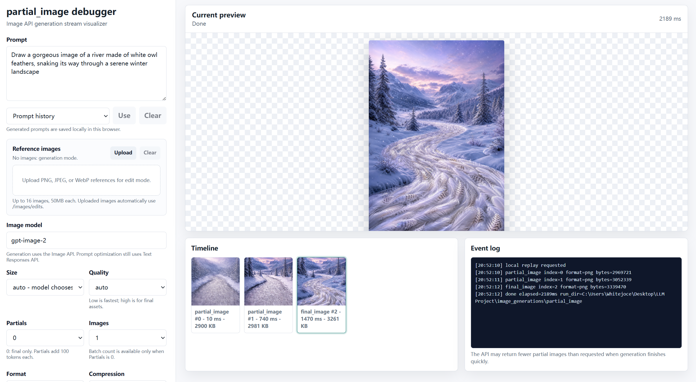

# Partial Image

> Coded with GPT-5.5 for the GPT-image-2 partial image API demo and testing.

一个用于调试和演示 OpenAI 图像生成流式中间图的本地 Web 工具。项目支持普通文生图、带参考图的图像编辑、partial image 实时预览、提示词优化，以及将每次运行的输出图片和参数保存到本地。



## 功能特性

- 实时查看图像生成过程中的 partial images
- 支持文生图和上传参考图进行图像编辑
- 支持 PNG、JPEG、WebP 输出格式
- 支持尺寸、质量、压缩率、背景、审核强度等参数配置
- 支持一键优化图像生成提示词
- 自动保存每次生成的图片、输入参考图和 `metadata.json`
- 内置 `river*.png` 示例图片，可离线回放演示流式效果

## 项目结构

```text
partial_image/
├── index.html          # 前端页面
├── web_app.py          # FastAPI 后端服务
├── partial_image.py    # 最小化 partial image API 示例脚本
├── river0.png          # 示例中间图
├── river1.png          # 示例中间图
├── river2.png          # 示例最终图
├── runs/               # 运行输出目录，建议不要提交到 GitHub
└── .env                # 本地环境变量，建议不要提交到 GitHub
```

## 环境要求

- Python 3.10 或更高版本
- 可用的 OpenAI API Key

安装依赖：

```bash
pip install openai python-dotenv fastapi uvicorn python-multipart
```

## 配置环境变量

在 `partial_image/.env` 中配置 API Key：

```env
api-key=你的_API_KEY
base-url=https://api.openai.com/v1
```

说明：

- `OPENAI_API_KEY`：必填，OpenAI API Key
- `OPENAI_BASE_URL`：可选，自定义 API Base URL 时使用
- `IMAGE_MODEL`：页面可修改，默认 `gpt-image-2`
- `TEXT_MODEL`：默认 `gpt-5.5`，用于提示词优化

## 启动 Web 工具

在项目根目录运行：

```bash
cd partial_image
uvicorn web_app:app --reload --host 127.0.0.1 --port 8000
```

然后打开浏览器访问：

```text
http://127.0.0.1:8000
```

## 使用方式

### 生成图片

1. 在页面中输入图片提示词。
2. 选择尺寸、质量、输出格式等参数。
3. 设置 `partial_images` 为 `1`、`2` 或 `3`，即可在生成过程中看到中间图。
4. 点击生成后，页面会逐步展示 partial images 和最终图片。

生成结果会保存到：

```text
partial_image/runs/生成时间戳/
```

每次运行目录中通常包含：

- `partial_*.png`：中间图
- `final_*.png`：最终图
- `metadata.json`：本次运行的参数、提示词和输入图片信息
- `inputs/`：上传的参考图

### 使用参考图编辑

在页面中上传 PNG、JPEG 或 WebP 图片后再生成，即会调用图像编辑接口。

限制：

- 最多上传 16 张参考图
- 单张图片最大 50 MB
- 支持 PNG、JPEG、WebP

### 回放示例图片

项目自带 `river0.png`、`river1.png`、`river2.png`。即使没有调用 API，也可以通过页面中的回放功能查看 partial image 的展示效果。

### 最小化脚本示例

也可以直接运行 `partial_image.py` 体验最小化 API 调用：

```bash
cd partial_image
python partial_image.py
```

脚本会请求生成一张图片，并把流式返回的 partial images 保存为 `river0.png`、`river1.png`、`river2.png`。

## API 接口

### `POST /api/generate`

生成图片或编辑图片，返回 NDJSON 流。

常用 JSON 请求示例：

```json
{
  "prompt": "一条由白色猫头鹰羽毛组成的河流，穿过安静的冬季森林",
  "size": "1024x1024",
  "quality": "auto",
  "partial_images": 2,
  "image_count": 1,
  "output_format": "png",
  "background": "auto",
  "moderation": "auto"
}
```

### `POST /api/optimize-prompt`

优化图像生成提示词。

```json
{
  "prompt": "雪地里的羽毛河流"
}
```

### `POST /api/replay`

回放项目目录中的 `river*.png` 示例图片。
